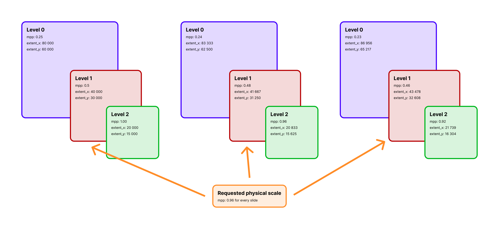

# Read Slides And Choose Resolution

!!! abstract "Overview"
    **Problem solved:** create a slide-level Ray dataset and normalize different whole-slide image formats onto one working resolution before you start tiling.

    **Use this example when:**

    - your input directory contains multiple slide files,
    - you want `ratiopath` to select the closest matching pyramid level automatically,
    - and you want later stages to work from metadata instead of opening pixel data immediately.

## Why This Approach

`read_slides` is the metadata entry point for distributed processing.
It reads slide dimensions, tile parameters, chosen level, and physical resolution into a Ray `Dataset`.
That lets you postpone expensive tile reads until you know which regions you actually need.

{ align=center }
*Selecting by `mpp` means each slide can land on a different pyramid level while still producing a consistent physical working scale.*

## Example

```python
from ratiopath.ray import read_slides

slides = read_slides(
    paths="data/",
    mpp=0.25,
    tile_extent=1024,
    stride=960,
)

slides.show(3)
```

??? example "Example output"
    ```text
    +--------------------------------------+----------+----------+---------------+---------------+----------+----------+-------+-------+-------+------------+
    | path                                 | extent_x | extent_y | tile_extent_x | tile_extent_y | stride_x | stride_y | mpp_x | mpp_y | level | downsample |
    +======================================+==========+==========+===============+===============+==========+==========+=======+=======+=======+============+
    | /data/slide_a.svs                    | 84320    | 61120    | 1024          | 1024          | 960      | 960      | 0.25  | 0.25  | 2     | 4.0        |
    | /data/slide_b.ome.tif                | 51200    | 40960    | 1024          | 1024          | 960      | 960      | 0.25  | 0.25  | 1     | 2.0        |
    | /data/slide_c.ndpi                   | 92160    | 70656    | 1024          | 1024          | 960      | 960      | 0.25  | 0.25  | 3     | 8.0        |
    +--------------------------------------+----------+----------+---------------+---------------+----------+----------+-------+-------+-------+------------+
    ```

??? info "Under the hood"
    `read_slides` builds a Ray `Dataset` by delegating file discovery and slide metadata extraction to `SlideMetaDatasource`.
    For each input path, the datasource opens the slide through the appropriate backend, resolves either the requested `mpp` or explicit `level`, and emits one metadata row per slide.

    The important design choice is that no tile pixels are read here.
    This stage only computes the information later steps need to choose tile coordinates and read the correct pyramid level.
    That keeps the first stage cheap to parallelize and makes it practical to inspect, repartition, cache, or persist the metadata table before any heavy image IO starts.

    When you pass `mpp`, the backend computes the closest available slide level by comparing the physical resolution of each level with your target.
    That is why slides with different scanner magnifications can still enter the same downstream workflow with a normalized working scale.

## What You Get

Each row contains metadata for one slide, typically including:

- `path`
- `extent_x`, `extent_y`
- `tile_extent_x`, `tile_extent_y`
- `stride_x`, `stride_y`
- `mpp_x`, `mpp_y`
- `level`
- `downsample`

## When To Use `mpp` Instead Of `level`

Use `mpp` when:

- your slides were scanned at different magnifications,
- you care about physical scale consistency,
- or you want the closest available level selected automatically per slide.

Use `level` when:

- all slides share the same pyramid structure,
- and you need an exact pyramid level for reproducibility or compatibility with an external workflow.

```python
slides = read_slides(
    paths=["slide_a.svs", "slide_b.ome.tif"],
    level=2,
    tile_extent=(512, 512),
    stride=(512, 512),
)
```

??? info "How level selection differs from MPP selection"
    `level` is an index into the slide pyramid, so it is exact but scanner-dependent.
    If two scanners use different downsample schedules, `level=2` may correspond to different physical resolutions.

    `mpp` is a physical target, so it is scanner-agnostic but approximate.
    `ratiopath` resolves it to the nearest available level for each slide and stores the chosen `mpp_x`, `mpp_y`, `level`, and `downsample` in the resulting dataset.
    That makes later stages explicit about the actual working scale instead of assuming all slides share the same pyramid layout.

## Related API

- [`ratiopath.ray.read_slides`](../../reference/ray/read_slides.md)
- [`ratiopath.openslide.OpenSlide`](../../reference/openslide.md)
