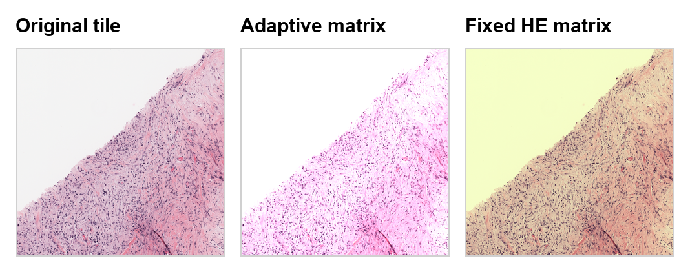

# Apply Stain Augmentation

!!! abstract "Overview"
    **Problem solved:** augment H&E-like tiles by perturbing stain channels rather than only applying generic RGB transforms.

    **Use this example when:**

    - you are training a model on histopathology tiles,
    - stain variation across labs or scanners matters,
    - or you want image-dependent stain matrices instead of a single fixed transform.

## Why This Approach

`StainAugmentor` is an Albumentations transform.
It separates an image into stain space, perturbs each stain channel, and then reconstructs the RGB image.
You can provide either:

- a fixed stain-conversion matrix,
- or a callable that estimates the matrix from each image.

!!! tip "Bundled example input"
    The figure below shows the two augmentation modes discussed on this page.
    The middle panel follows the adaptive-matrix workflow, while the right panel follows the fixed-`HE` workflow shown later on this page.

{ align=center }
*Using one real crop for all three panels makes it easier to see how the adaptive and fixed-matrix variants differ in practice.*

## Example With An Adaptive Matrix

```python
import numpy as np

from ratiopath.augmentations import StainAugmentor, estimate_stain_vectors
from ratiopath.augmentations.estimate_stain_vectors import HE
from ratiopath.openslide import OpenSlide

with OpenSlide("slide_a.tiff") as slide:
    tile = slide.read_tile(
        x=9216,
        y=7168,
        extent_x=2048,
        extent_y=2048,
        level=0,
    )

augmentor = StainAugmentor(
    conv_matrix=lambda image: estimate_stain_vectors(image, HE),
    alpha=0.05,
    beta=0.05,
    p=1.0,
)

augmented_tile = augmentor(image=tile)["image"]
```

??? example "Expected outputs"
    `augmented_tile` stays in the same image space as the input tile:

    - shape: `(2048, 2048, 3)`
    - dtype: `uint8`

    The pixel values change, but the tile dimensions and layout do not.

??? info "Under the hood"
    `estimate_stain_vectors` applies an optical-density transform, discards unsuitable pixels, and estimates a stain basis from the remaining signal.
    `StainAugmentor` then samples multiplicative and additive perturbations for each stain channel before reconstructing the RGB image.

    This is different from ordinary color jitter because the perturbation happens in stain space rather than directly in RGB.

## Example With A Fixed Matrix

```python
from ratiopath.augmentations import StainAugmentor
from ratiopath.augmentations.estimate_stain_vectors import HE

augmentor = StainAugmentor(
    conv_matrix=HE,
    alpha=0.02,
    beta=0.02,
    p=1.0,
)
```

??? example "Expected outputs"
    The fixed-matrix version produces the same kind of output array as the adaptive version.
    The difference is only in how the stain basis is chosen, not in the output tensor shape or datatype.

Use the fixed-matrix version when you want deterministic stain semantics across tiles and the adaptive version when slide-to-slide stain variation is large.

## Where This Fits In A Pipeline

This is usually a training-time step, not a Ray metadata step.
Common usage looks like:

- build a tile dataset with `read_slide_tiles`,
- load tiles into a model input pipeline,
- apply `StainAugmentor` during training augmentation.

## Related API

- [`ratiopath.augmentations.StainAugmentor`](../../reference/augmentations/stain_augmentor.md)
- [`ratiopath.augmentations.estimate_stain_vectors`](../../reference/augmentations/estimate_stain_vectors.md)
