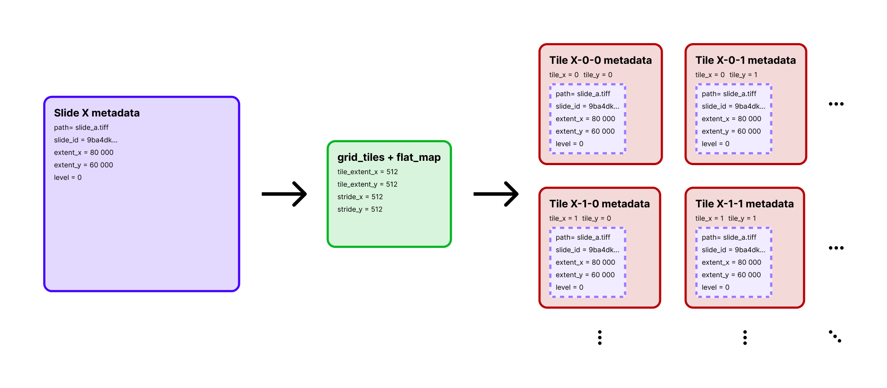

# Create An Annotation-Aware Tile Dataset

!!! abstract "Overview"
    **Problem solved:** build a tile dataset that carries annotation coverage per tile so you can train or filter on biologically meaningful regions rather than on raw tile coordinates alone.

    **Use this pipeline when:**

    - you have slide-level annotation files,
    - you need tile-level supervision or coverage thresholds,
    - and you want one dataset that combines slide metadata, tile coordinates, and annotation-derived signals.

## Workflow

1. Read slide metadata with `read_slides`.
2. Locate the corresponding annotation file for each slide.
3. Parse the annotation geometry.
4. Generate tile coordinates with `grid_tiles`.
5. Intersect annotations against each tile ROI with `tile_annotations`.
6. Store coverage in the output rows.

{ align=center }
*This pipeline first explodes one slide row into many tile rows, then attaches an `annotation_coverage` value to each tile.*

## Example Tile Rows

The table below shows representative tile rows from one annotated slide with `tile_extent=1024` and `stride=1024`.
These are the kinds of rows produced after the `flat_map(tiles_with_coverage)` step:

| path | tile_x | tile_y | annotation_coverage |
| --- | ---: | ---: | ---: |
| `sample_slide.tiff` | 14336 | 12288 | 0.210 |
| `sample_slide.tiff` | 8192 | 11264 | 0.408 |
| `sample_slide.tiff` | 10240 | 15360 | 0.841 |
| `sample_slide.tiff` | 10240 | 8192 | 1.000 |

This is usually the key conceptual shift in the pipeline: one slide row turns into many tile rows, and each row carries a quantitative label rather than just raw coordinates.

## Example

```python
from typing import Any

import numpy as np
from shapely import Polygon

from ratiopath.parsers import ASAPParser
from ratiopath.ray import read_slides
from ratiopath.tiling import grid_tiles, tile_annotations
from ratiopath.tiling.utils import row_hash


def add_annotation_path(row: dict[str, Any]) -> dict[str, Any]:
    row["annotation_path"] = row["path"].replace(".mrxs", ".xml")
    return row


def tiles_with_coverage(row: dict[str, Any]) -> list[dict[str, Any]]:
    parser = ASAPParser(row["annotation_path"])
    annotations = list(parser.get_polygons(name="Tumor.*"))

    roi = Polygon(
        [
            (0, 0),
            (row["tile_extent_x"], 0),
            (row["tile_extent_x"], row["tile_extent_y"]),
            (0, row["tile_extent_y"]),
        ]
    )

    coordinates = np.array(
        list(
            grid_tiles(
                slide_extent=(row["extent_x"], row["extent_y"]),
                tile_extent=(row["tile_extent_x"], row["tile_extent_y"]),
                stride=(row["stride_x"], row["stride_y"]),
                last="keep",
            )
        )
    )

    return [
        {
            "slide_id": row["id"],
            "path": row["path"],
            "tile_x": coordinates[i, 0],
            "tile_y": coordinates[i, 1],
            "annotation_coverage": geometry.area / roi.area,
        }
        for i, geometry in enumerate(
            tile_annotations(
                annotations=annotations,
                roi=roi,
                coordinates=coordinates,
                downsample=row["downsample"],
            )
        )
    ]


slides = read_slides("data", mpp=0.25, tile_extent=512, stride=512)
slides = slides.map(row_hash).map(add_annotation_path)

tiles = slides.flat_map(tiles_with_coverage)
positive_tiles = tiles.filter(lambda row: row["annotation_coverage"] >= 0.5)
```

??? info "Under the hood"
    This pipeline combines two spaces that must stay aligned:

    - slide space, where annotations are authored and slide metadata is resolved,
    - tile space, where each output row represents one fixed-size crop.

    The parser first converts annotation files into Shapely geometries.
    Then `grid_tiles` defines the tile origins for the chosen working resolution.
    `tile_annotations` handles the coordinate transformation between the working level and level 0 annotation space, intersects the tile ROI with the annotation set, and returns tile-local geometries.

    By storing coverage rather than the raw polygon set in each output row, the resulting dataset stays compact and works well with later thresholding, sampling, and model training steps.

## Adapting The Pipeline

- Replace `ASAPParser` with `GeoJSONParser` or `Darwin7JSONParser` when your source annotations use those formats.
- Change the ROI if you want to score only a subregion inside each tile.
- Keep all rows if you need continuous coverage values instead of thresholded selection.

??? info "Why ROI choice matters"
    The ROI is the geometry whose overlap you are actually measuring.
    If the ROI is the full tile, coverage reflects the proportion of the complete tile occupied by the annotation.
    If the ROI is a subregion, the same annotation can produce a very different coverage value because the denominator changes.

    That makes ROI design an important modeling decision, not just a technical parameter.
    It controls what a positive tile means in the final dataset.

## Related API

- [`ratiopath.parsers.ASAPParser`](../../reference/parsers/asap.md)
- [`ratiopath.parsers.GeoJSONParser`](../../reference/parsers/geojson.md)
- [`ratiopath.parsers.Darwin7JSONParser`](../../reference/parsers/darwin.md)
- [`ratiopath.tiling.annotations`](../../reference/tiling/annotations.md)
- [`ratiopath.tiling.tilers`](../../reference/tiling/tilers.md)
