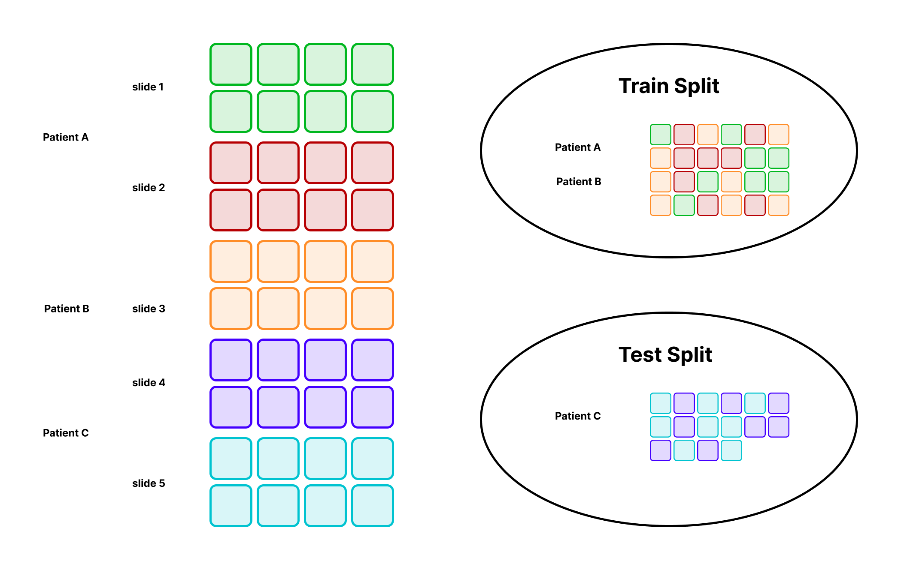

# Prepare A Training Dataset With Leakage-Safe Splits

!!! abstract "Overview"
    **Problem solved:** turn slides into train and test tile datasets while preserving class balance and preventing patient- or case-level leakage.

    **Use this pipeline when:**

    - each patient or case contributes multiple tiles,
    - you need train and test sets derived from the same raw slide corpus,
    - and you want the split decision to happen before tile extraction scales out.

## Workflow

1. Read slide metadata with `read_slides`.
2. Add stable slide identifiers plus patient and label metadata.
3. Split slides with `train_test_split(..., stratify=..., groups=...)`.
4. Build one tile pipeline per split.
5. Optionally attach annotation or overlay signals.
6. Save the resulting train and test tile datasets separately.

{ align=center }
*Split the slide table first, then build per-split tile datasets so every derived tile inherits a leak-safe parent assignment.*

## Example

```python
from typing import Any

import numpy as np
from ray.data.expressions import col

from ratiopath.model_selection import train_test_split
from ratiopath.ray import read_slides
from ratiopath.tiling import grid_tiles, read_slide_tiles
from ratiopath.tiling.utils import row_hash


def add_cohort_metadata(row: dict[str, Any]) -> dict[str, Any]:
    row["patient_id"] = row["path"].split("/")[-1].split("_")[0]
    row["label"] = 1 if "tumor" in row["path"] else 0
    return row


def expand_tiles(row: dict[str, Any]) -> list[dict[str, Any]]:
    return [
        {
            "slide_id": row["id"],
            "patient_id": row["patient_id"],
            "label": row["label"],
            "path": row["path"],
            "tile_x": x,
            "tile_y": y,
            "level": row["level"],
            "tile_extent_x": row["tile_extent_x"],
            "tile_extent_y": row["tile_extent_y"],
        }
        for x, y in grid_tiles(
            slide_extent=(row["extent_x"], row["extent_y"]),
            tile_extent=(row["tile_extent_x"], row["tile_extent_y"]),
            stride=(row["stride_x"], row["stride_y"]),
            last="keep",
        )
    ]


def build_tiles(split_slides):
    tiles = split_slides.flat_map(expand_tiles).repartition(target_num_rows_per_block=128)
    tiles = tiles.with_column(
        "tile",
        read_slide_tiles(
            col("path"),
            col("tile_x"),
            col("tile_y"),
            col("tile_extent_x"),
            col("tile_extent_y"),
            col("level"),
        ),
        num_cpus=1,
        memory=4 * 1024**3,
    )
    return tiles.filter(lambda row: row["tile"].std() > 8)


slides = read_slides("data", mpp=0.5, tile_extent=512, stride=512)
slides = slides.map(row_hash).map(add_cohort_metadata)

slide_table = slides.to_pandas()

train_slide_ids, test_slide_ids = train_test_split(
    slide_table["id"].to_numpy(),
    test_size=0.2,
    random_state=42,
    stratify=slide_table["label"].to_numpy(),
    groups=slide_table["patient_id"].to_numpy(),
)

train_ids = set(np.asarray(train_slide_ids).tolist())
test_ids = set(np.asarray(test_slide_ids).tolist())

train_slides = slides.filter(lambda row: row["id"] in train_ids)
test_slides = slides.filter(lambda row: row["id"] in test_ids)

train_tiles = build_tiles(train_slides)
test_tiles = build_tiles(test_slides)

train_tiles.write_parquet("train_tiles")
test_tiles.write_parquet("test_tiles")
```

??? info "Why the split happens at the slide table"
    The leakage decision should happen before you explode slides into thousands of tile rows.
    If you split after tiling, it becomes too easy for related tiles from the same patient or slide to land on both sides of the boundary.

    Splitting slide metadata first keeps the grouping logic simple and ensures every downstream tile inherits a leak-safe parent assignment.

## Useful Variants

- add a validation split by running the grouped split again on the training slides,
- enrich the split-specific tiles with `tile_annotations` or `tile_overlay_overlap`,
- or save only metadata first and defer `read_slide_tiles` to a later training loader.

## Related API

- [`ratiopath.model_selection.split`](../../reference/model_selection/split.md)
- [`ratiopath.ray.read_slides`](../../reference/ray/read_slides.md)
- [`ratiopath.tiling.tilers`](../../reference/tiling/tilers.md)
